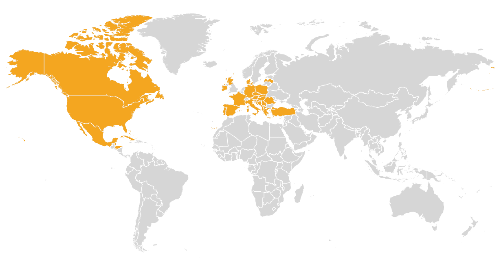

::: {.quick-links}
<i class="fa-brands fa-linkedin"></i> [LinkedIn](https://linkedin.com/in/christopher-hynes)
<i class="fa-brands fa-github"></i> [GitHub](https://github.com/hynesc)
<i class="fa-solid fa-file-pdf"></i> [Resume](assets/resume.pdf)
:::

## My Background

I'm an M.S. candidate in Computer Science at Georgia Tech, where I hold a 4.0 GPA and expect to graduate in December 2026. I earned a B.S. in Statistics and Economics, summa cum laude, from the University of South Carolina Honors College, also with a 4.0 GPA.

My work sits at the intersection of machine learning, data science, software development, and empirical research. I enjoy problems that require both careful analysis and solid implementation: designing experiments, comparing models, auditing results, and turning technical work into systems or explanations that other people can use.

Recent projects include a self-hosted Signal assistant with isolated per-chat memory and automatic summarization, an OpenAI-compatible multi-model LLM council, and graduate machine learning studies covering supervised learning, unsupervised learning, randomized optimization, and reinforcement learning. I also reimplemented and evaluated a published neural architecture for hospital readmission prediction, using repeated trials and statistical testing to distinguish reproducible findings from configuration-sensitive results.

Before graduate school, I worked as a data analyst intern at GreyNoise Intelligence, where I automated data-quality and reporting workflows and analyzed customer churn and lead conversion. As an undergraduate research assistant, I worked with economic, demographic, and public-health data on questions involving STEM-worker agglomeration, spatial segregation, and racial disparities in birth outcomes.

## Areas of Focus

- **Machine Learning & Evaluation:** Model selection, hyperparameter search, repeated experiments, statistical testing, learning curves, and performance/runtime tradeoffs.
- **Applied AI & LLM Systems:** Local model deployment, multi-model orchestration, retrieval and web search, memory and summarization, privacy-aware logging, and API development.
- **Data Science & Research:** Statistical analysis, causal inference, predictive modeling, reproducibility, and communicating technical findings to research and business audiences.

## Technical Skills

- **Programming:** Python, R, SQL; familiar with Java, Stata, and SAS
- **Machine Learning & Data:** PyTorch, scikit-learn, TensorFlow, Hugging Face Transformers, pandas, NumPy, tidyverse; supervised and unsupervised learning, reinforcement learning, NLP, and causal inference
- **Development & Visualization:** Git, Linux, Bash, Docker, FastAPI, Jupyter, Google Colab, Streamlit, Quarto, GitHub Actions, and LaTeX

## Outside of Work

I enjoy playing guitar, backpacking, traveling, and studying languages. I've traveled to 32 countries and speak advanced Spanish, intermediate German, and basic French.

{.about-map}
